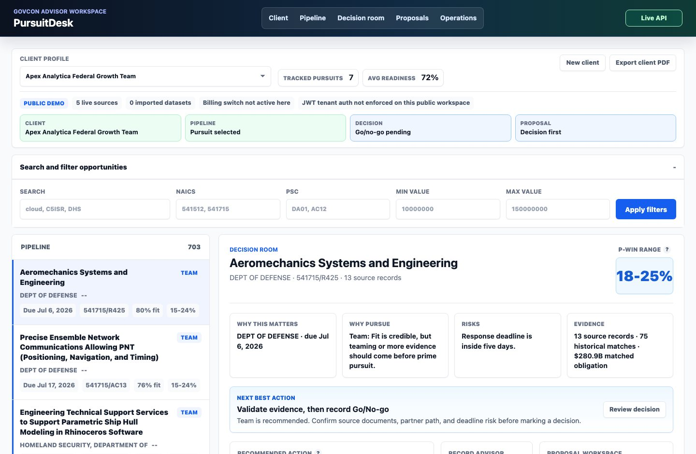
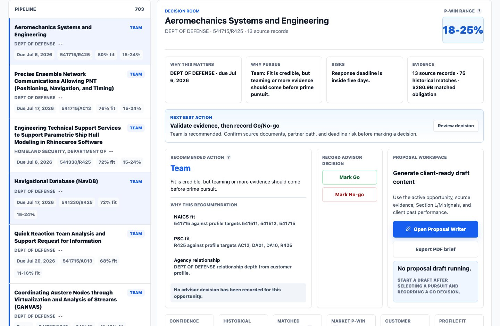
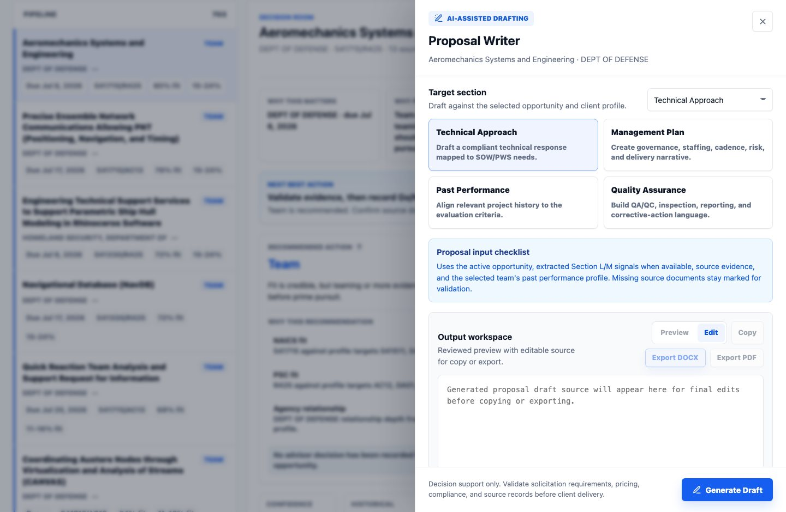
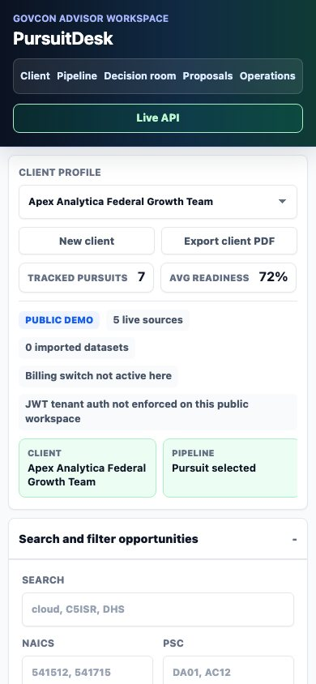
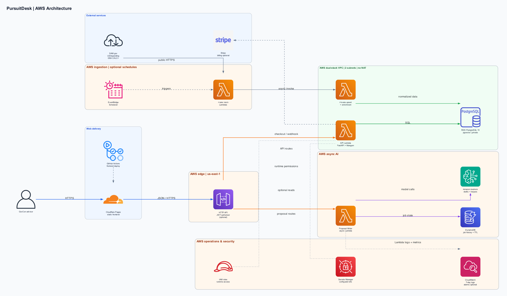

# PursuitDesk

PursuitDesk is a public GovCon consulting delivery platform for small-business advisors. It helps a consultant add and manage client profiles, score federal readiness, review live opportunity data, make go/no-go decisions, generate proposal drafts, track proposal history, and export client-ready PDF/DOCX deliverables.

Live demo:

- Frontend: https://pursuitdesk.pages.dev/
- Backend API: https://n2qx0wcyg8.execute-api.us-east-1.amazonaws.com

The user-facing product and GitHub repository are PursuitDesk. AWS resource names still use `govcon-captureos`.

## Screenshots

Consultant workspace with live opportunity pipeline, readiness context, P-win range, and next-best-action guidance:



Decision room for a selected opportunity, including rationale, risks, evidence, advisor decision controls, and proposal entry point:



Proposal Writer workspace with target-section controls and source/input checklist:



Responsive mobile layout:



## About

This project is built as a sellable SaaS-style workflow for GovCon advisors, not just a data dashboard. The frontend gives consultants a single workspace for client intake, readiness assessment, opportunity triage, capture workflow, proposal drafting, branded exports, and operational monitoring. The backend combines live public-sector data ingestion, tenant-aware scoring, source evidence, proposal-generation jobs, and production hardening switches for auth, billing, and observability.

The deployed demo intentionally keeps cost low: Cloudflare Pages serves the static frontend, API Gateway HTTP API routes requests to Python Lambda functions, RDS PostgreSQL with `pgvector` stores structured and semantic capture data, and DynamoDB stores async Proposal Writer jobs with TTL.

## Tech Stack

- Frontend: static HTML, CSS, and vanilla JavaScript deployed on Cloudflare Pages.
- API: Python 3.12, FastAPI, Mangum, Pydantic, PyJWT.
- Compute: AWS Lambda on ARM64 behind API Gateway v2 HTTP API.
- Data: Amazon RDS PostgreSQL 15, `pgvector`, `pg_trgm`, JSONB, generated search columns, HNSW vector index.
- Async jobs: DynamoDB on-demand table for Proposal Writer job state and history.
- AI: Amazon Bedrock Proposal Writer with Claude Sonnet (`us.anthropic.claude-sonnet-4-6`) for final proposal drafts, Amazon Nova Lite (`amazon.nova-lite-v1:0`) for lower-cost Section L/M extraction and evidence summarization, Nova Pro fallback, and deterministic/template fallbacks.
- Ingestion: SAM.gov opportunities, USAspending awards/subawards, FSRS-derived subaward signals, and GSA CALC+ labor-rate benchmarks.
- Infrastructure: Terraform, EventBridge Scheduler, Secrets Manager, CloudWatch alarms, GitHub Actions, Wrangler/Cloudflare Pages.
- Billing/auth readiness: Stripe Checkout/webhooks and JWT/JWKS enforcement switches are implemented but not enabled for the public demo.

## Engineering Highlights

- Multi-tenant GovCon workflow: tenant and user context, client profile rollups, readiness scoring, capture workflow state, notes, reminders, and branded report settings.
- Consultant-guided UX: compact workflow cues, recoverable filter empty states, next-best-action guidance, persistent proposal-job status, and background draft notifications.
- Source-backed capture analysis: live opportunity records, market P-win, client-adjusted P-win, evidence bundles, score-factor explanations, competitor/partner signals, CALC+ pricing context, and source drilldowns.
- Proposal Writer: async Bedrock-backed proposal jobs that use Nova Lite for fast, lower-cost preprocessing and Claude Sonnet for higher-quality final drafting, with citation-ready prompts, source evidence, client past-performance mapping, saved draft history, and client-side PDF/DOCX export.
- Low-cost cloud architecture: no NAT Gateway, no Aurora Serverless, no OpenSearch, no provisioned concurrency, bounded Lambda memory, short log retention, and on-demand DynamoDB.
- No-NAT ingestion pattern: public fetch Lambdas call public APIs and invoke private upsert Lambdas that write to private RDS, keeping database access private without paying for NAT.
- Production controls: Terraform switches for JWT auth, API Gateway authorizer, Stripe secrets, SAM.gov secret ingestion, EventBridge schedules, and optional CloudWatch alarms.
- Defensive public demo: strict frontend CSP posture is preserved, demo header auth is isolated from JWT-ready production paths, and source limitations are surfaced in reports.

## Evidence Matrix

| Area | Evidence |
|---|---|
| IaC | Terraform provisions API Gateway, Lambda, RDS PostgreSQL, DynamoDB proposal jobs, IAM, schedules, and optional alarms in `infra/terraform/`. |
| CI/CD | GitHub Actions validates Python syntax, frontend JavaScript syntax, Terraform format, Terraform validation, and whitespace checks; frontend deploy workflow uses Wrangler when Cloudflare credentials are configured. |
| Security | Private RDS security group boundary, JWT/JWKS enforcement switches, optional API Gateway JWT authorizer, Secrets Manager ARN wiring, CSP headers, and demo-header auth separation. |
| Reliability | Async Proposal Writer jobs, DynamoDB TTL, deterministic proposal fallbacks, bounded ingestion runs, workflow persistence, and documented rollback/recovery paths. |
| Observability | CloudWatch log groups with short retention, optional Lambda/API Gateway alarms, ingest watermarks, and in-app monitoring surfaces. |
| Cost | No NAT Gateway, no OpenSearch, no Aurora Serverless, no provisioned concurrency, ARM64 Lambdas, HTTP API, single-AZ RDS, on-demand DynamoDB with TTL, and bounded schedules. |
| Operations | Runbook, deployment notes, teardown guide, live ingest enablement script, and manual smoke checks. |
| Testing | Repository validation workflow, focused P-win/proposal-formatting/proposal-context unit tests, API route integration tests, and a Playwright consultant-workflow smoke test. |
| Documentation | Architecture overview, AWS diagram notes, ADRs, reviewer guide, security, observability, cost model, deployment, teardown, testing, and tradeoffs docs. |

## Architecture



PursuitDesk keeps the browser request path simple while separating public data fetches from private database writes:

- **Request flow:** Cloudflare Pages serves the static frontend, which calls API Gateway. FastAPI/Mangum and Proposal Writer Lambda functions handle API traffic, with RDS PostgreSQL/`pgvector` for application data and DynamoDB plus Amazon Bedrock for asynchronous proposal jobs.
- **Deployment flow:** GitHub Actions deploys `frontend/` to Cloudflare Pages through Wrangler when credentials are configured. Lambda packages are built locally and the AWS stack is deployed with Terraform; no AWS deployment workflow is committed.
- **Security:** RDS is not publicly accessible and accepts PostgreSQL traffic only from the Lambda security group. JWT/JWKS enforcement, an API Gateway JWT authorizer, and Secrets Manager references are supported but are configuration-dependent and disabled or blank by default.
- **Observability:** Lambda log groups retain CloudWatch logs for seven days by default. Optional Lambda error, ingest failure, and API Gateway 5xx alarms can be enabled through Terraform.
- **Cost controls:** The stack uses API Gateway HTTP API, small ARM64 Lambdas, single-AZ RDS, on-demand DynamoDB with TTL, bounded throttles and ingest runs, short log retention, and no NAT Gateway or provisioned concurrency.

See [docs/architecture-notes.md](docs/architecture-notes.md) for diagram evidence, optional-service labels, render instructions, and exclusions. The [logical architecture](docs/architecture.md) remains available as a simpler Mermaid companion.

Reviewer and operations docs:

- [Reviewer guide](docs/reviewer-guide.md)
- [Deployment](docs/deployment.md)
- [Runbook](docs/runbook.md)
- [Security](docs/security.md)
- [Observability](docs/observability.md)
- [Cost model](docs/cost-model.md)
- [Testing](docs/testing.md)
- [Tradeoffs](docs/tradeoffs.md)
- [Teardown](docs/teardown.md)
- [Architecture decision records](docs/adrs/README.md)

## Repository Layout

- `frontend/`: static Cloudflare Pages dashboard and client-side PDF/DOCX export code.
- `src/`: Python API, ingestion, entity resolution, proposal writer, auth, and partner-matching modules.
- `migrations/`: PostgreSQL migrations for `pgvector`, capture tables, CALC+ labor rates, paid-MVP workspace, auth/billing, and consultant delivery features.
- `infra/terraform/`: AWS infrastructure for API Gateway, Lambda, RDS PostgreSQL, DynamoDB proposal jobs, EventBridge schedules, and optional alarms.
- `scripts/`: Lambda packaging and live SAM.gov ingestion helpers.
- `.github/workflows/`: validation workflow and optional Cloudflare Pages deployment workflow.
- `docs/`: architecture, reviewer, operations, security, cost, testing, teardown, tradeoff, and ADR documentation.

## Cloudflare Pages

Cloudflare Pages Git integration settings for the frontend:

- Production branch: `main`
- Root directory: `frontend`
- Build command: leave blank
- Build output directory: `.`

The dashboard reads its backend base URL from `frontend/config.js`. It falls back to local demo data if the API is unavailable.

GitHub Actions deploys `frontend/` to Cloudflare Pages when `CLOUDFLARE_API_TOKEN` is set as a repository secret and `CLOUDFLARE_ACCOUNT_ID` is set as a repository variable.

## Lambda Packaging

Build deployable AWS Lambda artifacts before running Terraform:

```bash
./scripts/build_lambda_packages.sh
```

The script creates ARM64 Python 3.12-compatible zip files under `dist/` for the API, ingestion, entity resolver, and one-shot database admin Lambda.

Initialize or refresh the demo database after Terraform has deployed the Lambda functions:

```bash
aws lambda invoke \
  --function-name govcon-captureos-demo-db_admin \
  --cli-binary-format raw-in-base64-out \
  --payload '{"action":"migrate_and_seed","reset":true}' \
  /tmp/captureos-db-admin-response.json
```

## Deployment And Operations

Common validation:

```bash
python3 -m py_compile src/proposal_writer_lambda.py src/api_v1_endpoints.py src/db_admin_lambda.py src/gsa_api_ingest.py src/partner_matching.py src/mock_data_seeder.py
python3 -m pip install -r requirements-dev.txt
python3 -m unittest discover -s tests -p 'test_*.py'
node --check frontend/app.js
node --test tests/*.test.mjs
terraform -chdir=infra/terraform fmt -check
git diff --check
```

CI runs the same lightweight checks in `.github/workflows/validate.yml`, plus focused Python unit tests, API route integration tests, frontend formatting tests, a Playwright consultant-workflow smoke test, and Terraform init/validate with the backend disabled.

Backend build/deploy:

```bash
./scripts/build_lambda_packages.sh
terraform -chdir=infra/terraform apply -auto-approve
```

Frontend deploy:

```bash
npx wrangler@4 pages deploy frontend \
  --project-name pursuitdesk \
  --branch main \
  --commit-hash "$(git rev-parse --short HEAD)" \
  --commit-dirty=true
```

## Live SAM.gov Ingestion

SAM.gov requires a public API key for the Opportunities API. Keep that key out of source control and Terraform state:

```bash
export SAM_API_KEY="..."
./scripts/enable_live_sam_ingest.sh
```

The script creates or updates an AWS Secrets Manager secret, writes the secret ARN to the ignored `infra/terraform/live_ingest.auto.tfvars` file, enables the EventBridge Scheduler job, and runs a one-time active-opportunity backfill. The scheduled path uses a no-NAT split: public fetch Lambda to private VPC upsert Lambda.

Manual bridge backfill:

```bash
export SAM_API_KEY="..."
./scripts/backfill_sam_opportunities.py --days 30 --max-pages 5
unset SAM_API_KEY
```

Optional knobs:

```bash
GSA_INGEST_SCHEDULE_EXPRESSION="rate(12 hours)" \
GSA_BACKFILL_DAYS=60 \
GSA_BACKFILL_MAX_PAGES=20 \
./scripts/enable_live_sam_ingest.sh
```

## Production Hardening Switches

Set these Terraform variables before using the platform with paying customers:

- `auth_required = true`
- `jwt_issuer`, `jwt_audience`, `jwt_jwks_url`
- `enable_api_gateway_jwt_authorizer = true` when issuer/audience are stable
- `sam_api_key_secret_arn` and `enable_gsa_ingest_schedule = true`
- `stripe_api_key_secret_arn`, `stripe_webhook_secret_arn`, and `stripe_price_id`
- `enable_cloudwatch_alarms = true` if the added CloudWatch alarm cost is acceptable

The public demo uses `demo_header_context` so the Cloudflare page can be exercised without login. JWT validation and API Gateway authorizer support exist, but production authentication is not enabled for the demo URL.

## What I Would Improve Next

- Enforce JWT tenant claims and connect a real identity provider before any paid production rollout.
- Activate Stripe billing with real products, customer lifecycle handling, and account access controls.
- Replace remaining seeded/import-like client examples with advisor-imported customer records.
- Deepen SAM.gov attachment extraction for more file formats and add more proposal quality regression tests.
- Add authenticated tenant e2e tests once production auth is enabled.
- Expand guided onboarding and add role-based permissions for real consultant teams.

## Privacy, Security, And Limitations

- Do not commit Terraform state, `.tfvars`, API keys, `.env` files, local secrets, generated PDFs, or downloaded customer material.
- Proposal PDFs/DOCX files are generated client-side from saved draft text; proposal binary files are not persisted by the backend.
- PursuitDesk provides decision support only. Consultants remain responsible for validating source records, FAR/agency requirements, client eligibility, pricing assumptions, conflicts, and proposal compliance.
- Demo client profiles, past performance examples, reminders, and workflow examples may include seeded or imported baseline data and should be replaced with verified customer data before production use.
- Live SAM.gov opportunity records are the source of truth for active opportunities. Document extraction and SOW embeddings improve proposal context but should be treated as advisory until validated against source documents.
