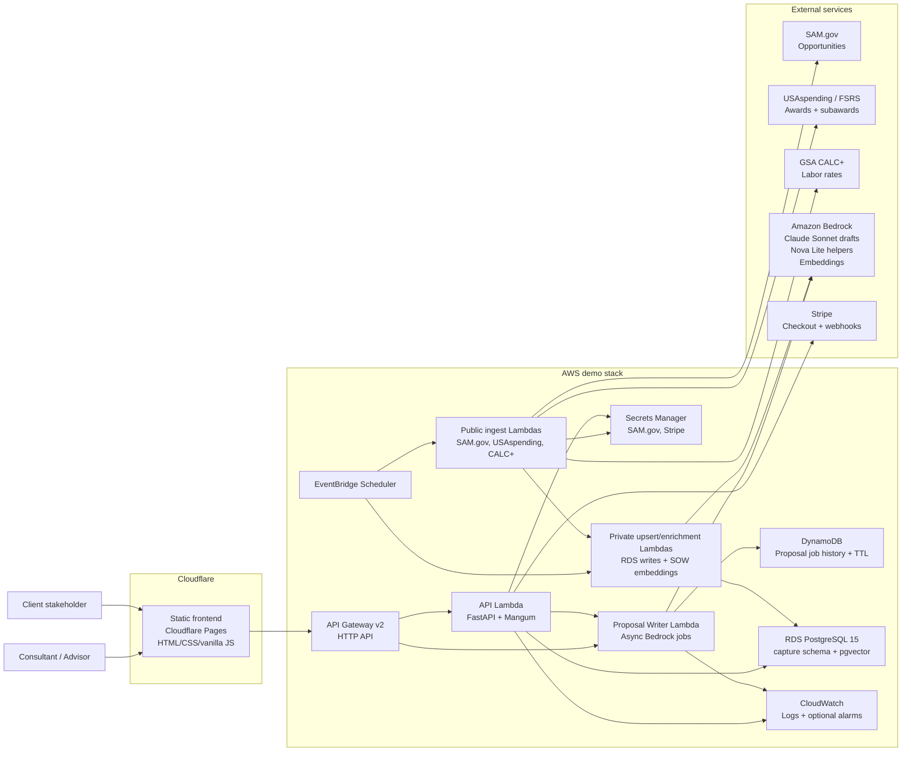

# Architecture

PursuitDesk is a static frontend plus serverless API for GovCon consulting workflows. It is optimized for a public demo and early paid-MVP path: low idle cost, live public procurement data ingestion, private relational storage, tenant-aware scoring, and async proposal drafting.

## Container Diagram

## Runtime Flow

1. A consultant opens the Cloudflare Pages frontend and selects or creates a client profile.
2. The frontend calls API Gateway with demo tenant headers or a bearer token, depending on auth configuration.
3. The FastAPI Lambda loads tenant context, client profile data, readiness, active opportunities, workflow state, evidence bundles, billing status, reminders, and report settings from PostgreSQL.
4. Capture analysis combines live SAM.gov opportunity fields with historical award/subaward evidence, partner signals, CALC+ rates, pgvector/SOW signals when present, and client profile fit.
5. Go/no-go decisions, notes, reminders, past-performance imports, white-label settings, and workflow updates are persisted in PostgreSQL.
6. Proposal Writer requests create DynamoDB job records and invoke the non-VPC Proposal Writer Lambda asynchronously.
7. The Proposal Writer Lambda uses Amazon Nova Lite (`amazon.nova-lite-v1:0`) for lower-cost Section L/M extraction and evidence summarization, then Claude Sonnet (`us.anthropic.claude-sonnet-4-6`) for higher-quality final proposal drafting. It falls back when needed, stores draft text in the DynamoDB job record, and exposes list/detail polling endpoints.
8. The frontend renders saved proposal history and generates PDF/DOCX exports client-side from draft markdown.

## Data Ingestion Flow

1. EventBridge Scheduler triggers bounded ingestion jobs.
2. Public ingest Lambdas call external public APIs without requiring a NAT Gateway.
3. Ingest Lambdas normalize source records and invoke VPC-attached upsert Lambdas.
4. Upsert Lambdas write to private RDS PostgreSQL and refresh data freshness watermarks.
5. SAM.gov enrichment can extract source text and create embeddings for `pgvector`-backed matching.

## Deployment Shape

- `frontend/` is deployed as static assets on Cloudflare Pages.
- `src/` and `migrations/` are packaged into ARM64 Python 3.12 Lambda zip artifacts by `scripts/build_lambda_packages.sh`.
- Terraform in `infra/terraform/` provisions API Gateway, Lambda, RDS, DynamoDB, IAM, EventBridge Scheduler, Secrets Manager references, and optional alarms.
- GitHub Actions can deploy the frontend when Cloudflare credentials are configured.
- Database migrations and demo seeding are run through the `db_admin` Lambda.

## Proposal Model Routing

- Nova Lite handles short helper tasks: extracting Section L/M signals, summarizing opportunity evidence, and preparing compact context for the final model.
- Claude Sonnet handles final proposal narrative because that step needs stronger long-form writing, instruction following, and source-grounded synthesis.
- Nova Pro and deterministic templates are fallback paths so proposal generation can degrade gracefully if the primary Sonnet call is unavailable.

## Key Constraints

- Keep public demo idle cost low: no NAT Gateway, no Aurora Serverless, no OpenSearch, no provisioned concurrency, no RDS Proxy, and no long log retention by default.
- Keep RDS private: Lambda security groups can reach PostgreSQL; the database has no public endpoint.
- Preserve strict frontend security posture: do not loosen CSP with inline scripts/styles.
- Keep live active opportunities source-backed by SAM.gov; do not reintroduce seeded SAM opportunity rows as the live source of truth.
- Keep proposal binary storage out of scope unless there is a deliberate product/storage decision.
- Use demo header context for the public demo only; enable JWT/API Gateway authorizer before paid production use.
